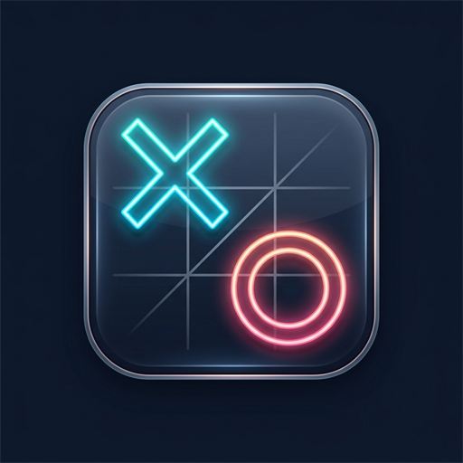

# 🎮 Flutter Tic-Tac-Toe

<p align="center">
  
</p>

<p align="center">
  A modern, responsive, and interview-ready <b>Tic-Tac-Toe</b> application built with <b>Flutter</b> and <b>Dart</b>.<br>
  Engineered with decoupled clean architecture, error handling, and 100% test suite coverage.
</p>

<p align="center">
  
  
  
  
  
</p>

---

## ✨ Features

- **Dual Game Modes:**
  - **2 Players (Pass & Play):** Local multiplayer on the same device with alternating turns between Player X and Player O.
  - **User vs Computer:** Play against an automated Computer opponent that makes random legal moves with a realistic thinking delay.
- **Scoreboard & Stat Tracking:**
  - Tracks Player X wins, Player O / Computer wins, and Ties.
  - Highlights the currently active player with a glowing border.
  - Confirmation dialog before resetting scores to prevent accidental data loss.
- **Responsive Modern UI:**
  - Sleek **Dark Mode** (Deep Slate `#0F172A`) with vibrant electric cyan (X) and sunset rose (O) accents.
  - Smooth pop-in scale transitions when marks are placed.
  - Radiant amber/gold glow highlighting winning combinations (rows, columns, diagonals).
  - Responsive layout constrained to prevent `RenderFlex` overflow on any screen dimension (phones, tablets, desktop).
- **Error Handling & Resilience:**
  - Custom `MoveException` class for out-of-bounds, occupied cell, or post-game actions.
  - UI tap locking during the computer's turn to prevent race conditions or spam clicks.
  - Safe bounds checking on all grid interactions.

---

## 🏛️ Architecture & Project Structure

The project follows a **decoupled architecture**, separating pure Dart business logic from Flutter presentation widgets. This makes the game logic completely independent and testable without widget bindings.

```
lib/
├── logic/
│   └── tic_tac_toe_game.dart   # Pure Dart engine: board state, win/draw algorithms,
│                               # AI random move generator, and MoveException
├── models/
│   ├── game_mode.dart          # Enum: twoPlayers, vsComputer
│   ├── game_status.dart        # Enum: inProgress, won, draw
│   └── player.dart             # Enum: none, x, o
├── screens/
│   └── game_screen.dart        # Primary stateful screen coordinating moves & AI turns
├── theme/
│   └── app_theme.dart          # Central theme configuration & color tokens
└── widgets/
    ├── board_cell.dart         # Interactive cell with animations and winning glow
    ├── game_board.dart         # 3x3 GridView layout
    ├── game_controls.dart      # 'New Round' and 'Reset Scores' buttons
    ├── mode_selector.dart      # Segmented mode toggle
    ├── scoreboard_card.dart    # Score counter display
    └── status_banner.dart      # Dynamic turn and victory status indicator
```

---

## 🧪 Testing & Code Quality

The project includes unit and widget tests covering all edge cases:

```bash
# Run all unit and widget tests
flutter test

# Run static analysis
flutter analyze
```

### Test Coverage Highlights:
- ✅ Clean initial board state & starting turn
- ✅ Turn alternation between players
- ✅ Row, column, and diagonal win detection
- ✅ Draw / stalemate detection
- ✅ `MoveException` on occupied cell, invalid index, or move after game over
- ✅ Random AI move selection from valid unoccupied cells
- ✅ Full widget tree rendering, tapping, mode switching, and computer move responses

---

## 🚀 Getting Started

### Prerequisites
- [Flutter SDK](https://flutter.dev/docs/get-started/install) (3.38.5 or higher recommended)
- Google Chrome (for Web) or Android device/emulator (for Android)

### Installation & Run

1. **Clone the repository:**
   ```bash
   git clone https://github.com/your-username/tic_tac_toe.git
   cd tic_tac_toe
   ```

2. **Get dependencies:**
   ```bash
   flutter pub get
   ```

3. **Run on Web:**
   ```bash
   flutter run -d chrome
   ```

4. **Run on Android:**
   ```bash
   flutter run -d android
   ```

5. **Build production web release:**
   ```bash
   flutter build web
   ```

---

## 📜 License
This project is open-source and available under the [MIT License](LICENSE).
